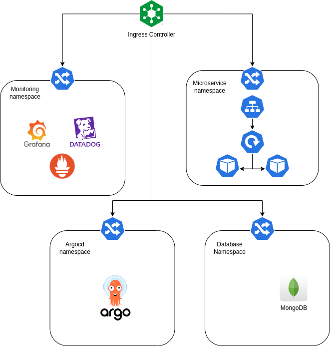

# Quotes Explorer

## Overview

This is a POC for a microservices application that enables CRUD operations on famous **Quotes**.

## Automation

The whole infrastructure is built With Terraform. The Different components have been distributed into different microstacks.

- `Main stack` : Contains The actual kubernetes cluster provisioning.

- `Argocd stack` : Contains argocd and its relevant configuration.

- `Monitoring stack` : Provisions the Helm charts for the different monitoring tools we're using ( Prometheus, Grafana and Datadog ).

- `Databases stack` : Provisions Mongodb.

The actual microservice is defined in a `Helm Chart`  and deployed using `Argocd`.

The different stacks have **remote terraform state files**. All saved on Azure, the initial provisioning for the storage account is done in the `terraform-backend` project.

## Deployment

The Microservices are deployed using Argocd, the different other components are deployed through terraform each within its respective namespace. Here is the architecture :

## Automation

### Metrics

a few metrics have been defined that are exposed through `Grafana`:
- `number_of_request` : Stores the number of requests by **status**.
- `searched_quotes` : Stores the number of searched quotes by client and name.

### Logs

We used structured logs and we configured the microservice to send them to `Datadog`. each log message contains the `request_id`, the `client` in addition to the `span_id`.

### Tracing

We Integrated openTelemetry logs using `Datadog` for the different endpoints. Also containing the `request_id` and the `client`.